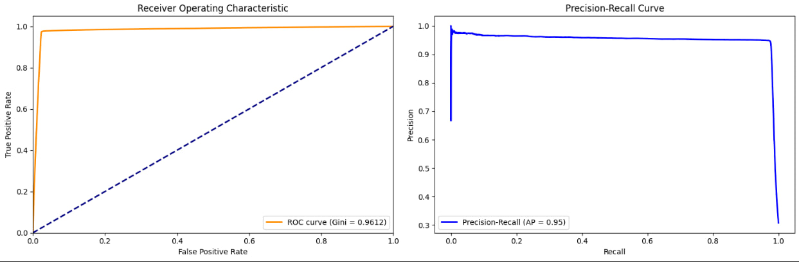
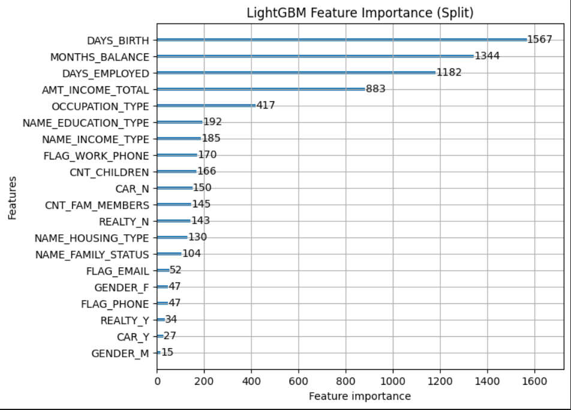
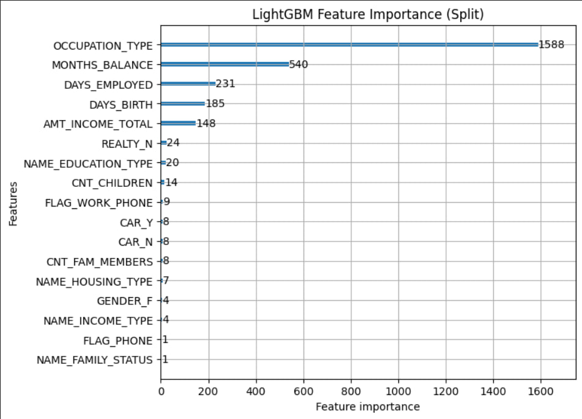

Проект представляет собой модель машинного обучения для скоринга кредитных карт, которая прогнозирует вероятность дефолтов заемщиков. Модель построена на алгоритме LightGBM и предназначена для помощи банкам в оценке кредитных рисков.

Используемые технологии
LightGBM - градиентный бустинг для бинарной классификации

Scikit-learn - разделение данных и метрики оценки

Matplotlib - визуализация результатов

Метрики оценки

Accuracy - общая точность классификации

AUC-ROC - площадь под ROC-кривой

Gini coefficient - коэффициент Джини

Average Precision - средняя точность

Так же была простроена feature importance диаграмма для оценки важности параметра

Мы можем регулировать "важность" какого-то параметра. В этом коде  OCCUPATION_TYPE сделали в 10 раз важнее. Результат на графике ниже. Как мы видим, распределение параметров изменилось

